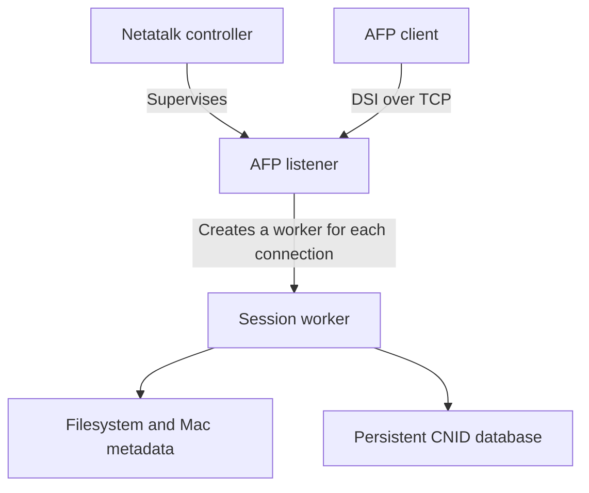

# Developer Documentation

Netatalk is a Free and Open Source AFP (Apple Filing Protocol) server for Unix-like systems.
It provides file sharing for AFP clients: notably Macs but also cross-platform clients.
Major differentiating features compared to other network file system protocols include
support for rich Mac-style metadata, ultra-fast CNID-based file identity, sophisticated
caching and locking mechanisms, and support for legacy AppleTalk networking.

This page introduces the architecture and concepts useful when developing Netatalk.
See the [user manual](https://netatalk.io/manual/en/) for installation and configuration.

## Architecture Overview

Netatalk separates service supervision, connection handling, and client sessions.
Shared libraries provide protocol handling, metadata storage, character conversion,
and database access used by the server and its utilities.

| Component | Responsibility |
| --- | --- |
| Controller | Starts and supervises the AFP server and manages service discovery. |
| AFP listener | Accepts connections, tracks session workers, and relays communication between them. |
| Session worker | Handles a client's authentication, open volumes and forks, AFP requests, and caches. |
| Shared libraries | Provide reusable protocol, storage, and platform support. |
| Maintenance utilities | Inspect, verify, and maintain file metadata and CNID databases. |

### Process Model

In normal service operation, the *netatalk* controller supervises the *afpd* AFP listener.
For each new TCP connection, the listener forks a session worker that handles
the client's requests. Each worker maintains its own session state and caches,
while accessing the files and persistent database records belonging to shared volumes.



Workers communicate with the listener for session coordination and to relay
cache hints to other workers. This communication helps sessions respond to
changes made by other AFP clients without sharing their in-memory caches.
AppleTalk services are managed separately from the AFP controller.

### Network Protocol Stack

AFP defines the file operations exchanged between client and server.
Netatalk carries AFP over TCP using DSI (Data Stream Interface),
or optionally over AppleTalk using ASP (AppleTalk Session Protocol).
Both transports lead to the server's AFP command handlers.

The **afpd** daemon provides AFP over either transport.
See [AppleTalk Protocol Family](https://netatalk.io/developer/md_developer_2ddp)
for the responsibilities of the AppleTalk services and their host networking requirements.

With AppleTalk support, the protocol stack looks like this.
Protocols above the kernel boundary are implemented in Netatalk's daemons and libraries;
the host kernel supplies the network transports below it.

```txt
    AFP                          AFP
     |                            |
    ASP    PAP                   DSI
      \   /                       |
       ATP RTMP NBP ZIP AEP       | (TCP port 548)
        |    |   |   |   |        |
   -+---------------------------------------------------+- (kernel boundary)
    |                    Socket                         |
    +-----------------------+------------+--------------+
    |                       |     TCP    |    UDP       |
    |          DDP          +------------+--------------+
    |                       |       IP v4 or v6         |
    +-----------------------+---------------------------+
    |                Network Interface                  |
    +---------------------------------------------------+
```

Without AppleTalk, the AFP transport stack is simpler:

```txt
          AFP
           |
          DSI
           |
           | (TCP port 548)
           |
   -+---------------------------+- (kernel boundary)
    |         Socket            |
    +------------+--------------+
    |     TCP    |    UDP       |
    +------------+--------------+
    |       IP v4 or v6         |
    +---------------------------+
    |     Network Interface     |
    +---------------------------+
```

See [DSI over TCP Implementation Notes](https://netatalk.io/developer/md_developer_2dsi)
for transport implementation details.

Service discovery helps clients locate a server, but is separate from the
transport carrying AFP requests. Advertising a service does not establish an
authenticated file-sharing session.

## Volumes, File Identity, and Mac Metadata

An AFP volume is a configured share with its own access rules, metadata storage
policy, and CNID database. A session opens a volume before accessing its files
and directories. Filesystem permissions and volume policy determine which
operations the authenticated user can perform.

AFP clients use Catalog Node Identifiers (CNIDs) to refer to files and directories.
Netatalk maintains persistent mappings between these identifiers and objects in
the host filesystem. A file's identity must be considered separately from its
current name or location, especially when handling moves and renames.

Mac files can have both a data fork and a resource fork, together with metadata
such as Finder information. Netatalk translates these concepts into storage
supported by the host filesystem, using extended attributes and AppleDouble
files according to the volume's storage policy.

| Stored information | Purpose | Storage type |
| --- | --- | --- |
| Data fork | The file's main contents | Regular filesystem file |
| Resource fork and Mac metadata | Additional contents and attributes expected by Mac clients | Extended attributes (xattrs) or AppleDouble sidecar files |
| CNID records | Persistent file and directory identities within a volume | Embedded SQLite database or a MySQL/MariaDB database server |

The CNID database and Mac metadata storage have different responsibilities and
lifecycles. A change to file contents, metadata, or location may require updates
to more than one of these stores.

Filenames also cross a compatibility boundary: classic clients use legacy Mac
character sets, while newer AFP clients use Unicode. Character conversion and
normalization must preserve the relationship between client-visible names,
filesystem names, and persistent identities.

## Authentication and Access Control

Authentication is provided by loadable User Authentication Modules (UAMs).
The methods available to a client depend on the server's build, configuration,
and the client's capabilities. Authentication establishes a user identity;
volume restrictions, filesystem permissions, and access control lists determine
what that identity can access.

In normal service mode, the server starts with privileges needed to manage
sessions and performs file operations under the authenticated user's effective
identity. A restricted single-user mode serves only the identity of the user
running the server. Changes to session handling must preserve these boundaries
through login, reconnect, and cleanup.

## Caching and Consistency

Session workers cache filesystem information to reduce repeated lookups and I/O.
These caches belong to individual workers; persistent files and CNID records
are shared between sessions.

When changing a file operation, consider both the persistent update and the
cached state it affects. Renames, deletions, metadata writes, and error recovery
must leave other sessions able to discover the current state, including changes
made through local tools or another file-sharing service.
See [Directory Cache Optimization](https://netatalk.io/developer/md_developer_2dircache)
for validation and performance details.
