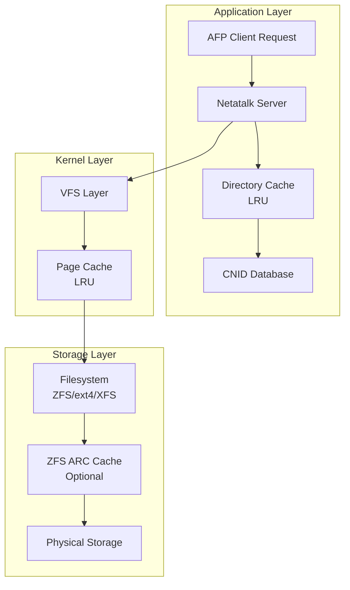
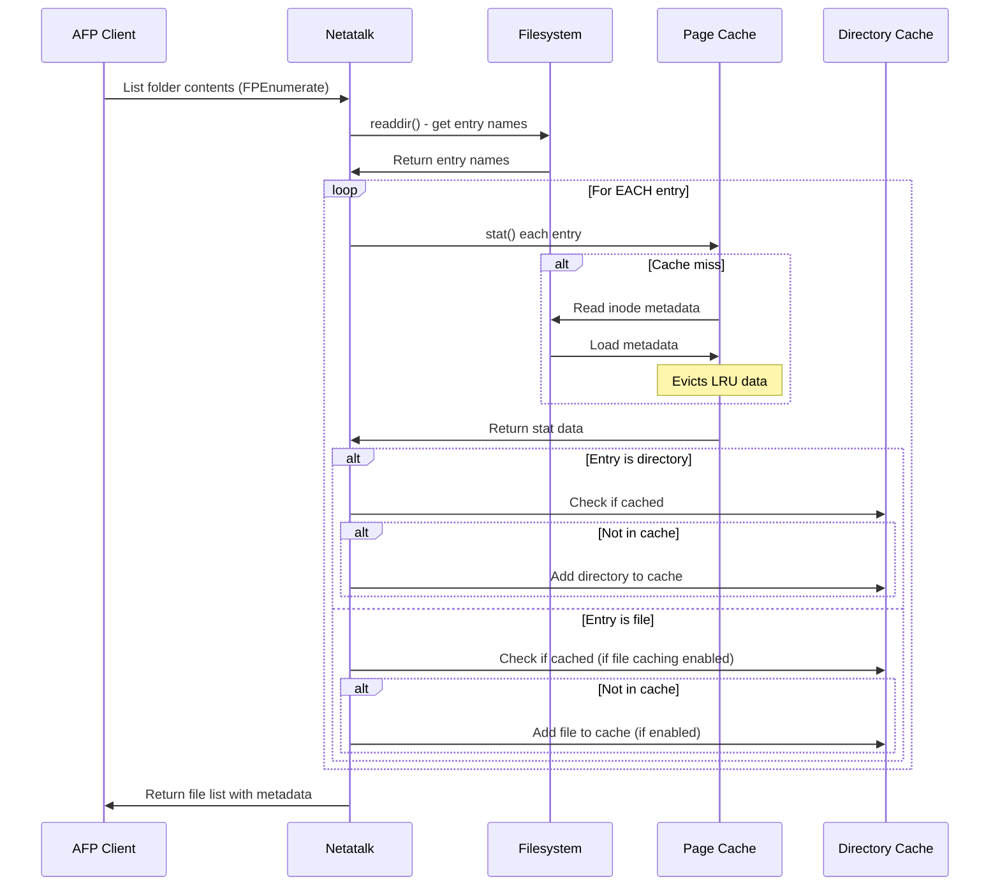
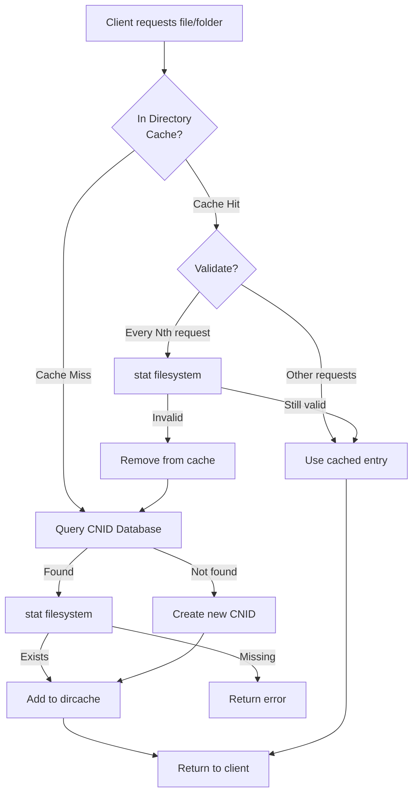
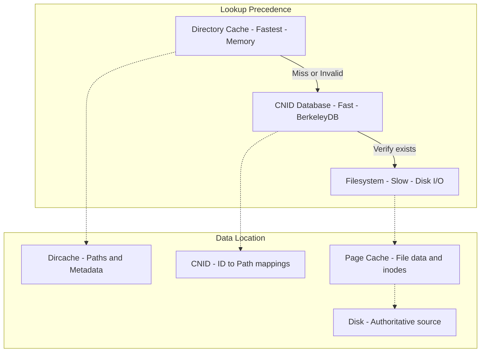
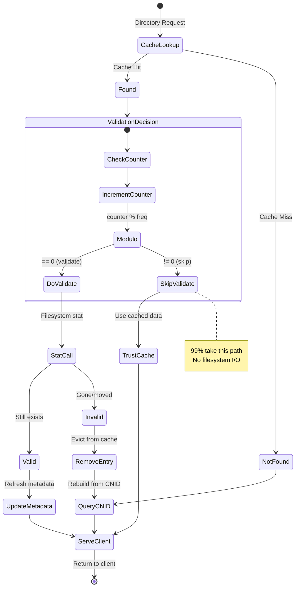
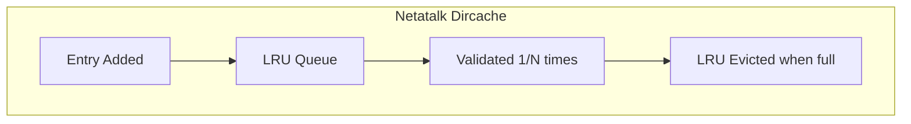
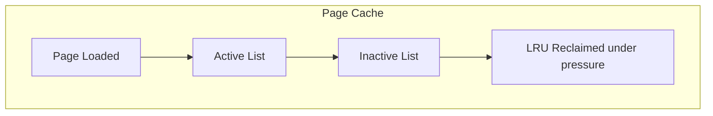
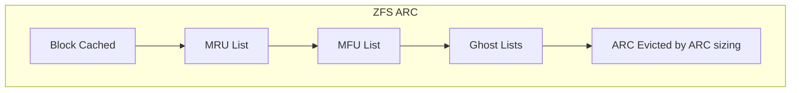

# Directory Cache Optimization

*The Hidden Cost of Validation: How Netatalk's Directory Cache Optimization Reduces Storage Stack Pressure*

## Introduction: The Invisible Performance Tax

When you access a file on a network share, you're triggering a cascade of operations through multiple cache layers.
Each layer tries to optimize performance, but they can work against each other in surprising ways.
This article explores how Netatalk's probabilistic directory cache validation reduces I/O
by working with the storage page cache.

---

## Part 1: The Storage Stack

Modern file servers orchestrate multiple cache layers, each with its own purpose and behavior:



Each cache layer uses an **LRU (Least Recently Used)** algorithm to decide what to keep in memory
(ZFS uses ARC instead of LRU).
This works well when access patterns match LRU assumptions, but breaks down with certain workloads
(especially scan workloads)—and that's where our story begins.

---

## Part 2: The Page Cache Problem

The Linux page cache is incredibly fast and nearly invisible.
It automatically caches file data and metadata in RAM, but here's the catch:
**you can't directly control what stays in cache**.

LRU Performance Issues:

Degeneration Under Common Patterns: LRU can perform poorly with certain access patterns.
For example, if an application loops over an array larger than the number of pages in the cache,
it will cause a page fault for every access, leading to inefficiency
(the cache churns and does not hold data long enough to achieve a good hit rate).

Cache Pollution: LRU may evict pages that are frequently accessed but not necessarily the most relevant,
which can lead to less optimal cache performance.
For example when enumerating paths to move around a directory tree,
Netatalk historically (and still does today by default,
until you apply the new `afp.conf` tuning options shown below)
performed an IO stat operation every time it reads a dircache entry to validate the file/directory still exists.
These IO stat validations allow Netatalk to detect external filesystem changes,
but keep unneeded data warm in the page cache,
pushing other more important objects off the page cache and increasing disk IO -
even though Netatalk has the dircache containing everything needed.

### How Directory Enumeration Works

When a client browses a Netatalk network folder, here's the actual sequence:



**Key insights from enumerate.c**:

1. All entries are read from filesystem via `readdir()` and `stat()` all - high page-cache/disk demand
2. **Directories**: Cache checked before adding, avoiding duplicate entries
3. **Files**: Cache is NOT checked during enumeration - always processed via `getfilparams()`
which may add them to cache internally

**Current enumeration inefficiency:**

- **Every file** is `stat()`'ed on every enumeration
- **Every directory** is `stat()`'ed, then cache is checked to avoid duplicate entries
- Repeatedly browsing a folder with 10,000 files = 10,000 stat calls each time (LRU scanning problem)

**Future optimization opportunity - Cache-First Enumeration:**

Optimal approach:

1. **readdir()**: Get list of entry names from filesystem (unavoidable - must know what exists)
2. **For each entry**: Check `dircache_search_by_name()` first
   - **Cache HIT**: Use cached metadata
   - **Cache MISS**: Fall back to `stat()` and add to cache
3. **Result**: Second enumeration of same folder could be ~99% cache-served (only 1% stat for probabilistic validation)

Would potentially transform repeated directory browsing from O(n) stat calls to O(n/100) stat calls,
eliminating most filesystem I/O.

### The LRU Scanning Problem

LRU caches have a fundamental weakness called the **scanning problem**:

When Netatalk validates thousands of entries, each `stat()` call:

1. Checks the page cache
2. Can causes a cache miss (directories and directory trees have many entries)
3. Loads the inode from disk / or reads from page cache (either adds to page cache or refreshes timer to keep in page cache)
4. **Evicts something potentially more valuable**

Parent folder recursion:

Each directory entry, stores its parent ID, and each parent ID has its own directory cache entry,
providing a recursive chain (path) to root.
When a new directory is accessed/added,
dirlookup() recursively calls itself until it finds a cached ancestor or reaches volume root.
Every recursive lookup also results in many more stat calls.
So even opening a small folder directly,
still requires stat'ing every level of the whole path to be pushed into the page cache.

If the dircache max size is small (by default just 8192 entries), as you move around your file share,
old entries are pushed off (evicted) as new ones are added.
This high entry rotation is known as "scan eviction" and means by the time you want to go back to a previous directory
and read a cached entry, it has likely already been evicted which can cause a cascade effect of recursive lookups
and stats calls to restore the broken cached paths if parent entries are evicted.
So unless your whole file server has less than 8192 file and directories,
it is recommended to increase the `dircache size` value in [afp.conf](https://netatalk.io/manual/en/afp.conf.5).

Future releases will increase the maximum size of the dircache once existing performance issues are addressed.
We are also considering retaining directories over files during eviction
to reduce recursive path discoveries after parent folders are evicted.

---

## Part 3: Why This Goes Unnoticed

The page cache operates at memory speed when it hits, making overhead hard to measure:

The real cost isn't the individual `stat()` calls—it's the **cascade effect**:

- Your working set gets evicted from page cache
- Filesystem queries slow down
- Application data must be re-read from disk
- Overall system responsiveness degrades

However, there is only a single Page Cache per kernel.
So this new dircache change in Netatalk to validate dircache periodically
means less interference with other services on the same instance.

---

## Part 4: How Files Are Found - The Lookup Hierarchy

Before understanding the probabilistic solution,
let's see how Netatalk finds files and the precedence between cache layers:

### Initial File Discovery Flow



### The Precedence Hierarchy



### Key Points

1. **Directory Cache** is checked first (fastest, in-memory)
2. **CNID Database** provides persistent ID→path mappings
3. **Filesystem** is the ultimate authority (via stat calls)
4. **Page Cache** transparently accelerates filesystem access

## Part 5: The Probabilistic Solution

With the lookup hierarchy understood, here's how probabilistic validation optimizes the flow:



The key insight: **We don't skip the cache hierarchy, we skip the validation step**.
Files are still properly discovered through CNID when not cached,
but we avoid repeatedly verifying cached entries still exist.

### Configuration Example

```ini
# afp.conf
dircache validation freq = 100  # Validate 1 in 100 lookups
```

With this setting:

- **99% of stat() calls eliminated**
- Page cache remains focused on hot data
- Any Invalid entries (files/dirs/paths changed outside of Netatalk) are caught and corrected on use
- Self-healing through CNID re-query on failures

---

## Part 6: Understanding Cache Lifetimes

Different cache layers have different retention strategies:







By trusting and reducing validation calls at the fastest layer (dircache),
we reduce pressure on the subsequent cache layers:

- **Dircache**: Keeps frequently accessed directory entries
- **Page Cache**: Retains genuinely hot data
- **ZFS ARC**: Maintains frequently/recently used blocks

---

## Part 7: Monitoring the Improvement

You can observe the benefits of dircache validation optimization using these metrics:

- **Dircache statistics via logs**: Monitor `invalid_on_use` counter (should be low, indicating cached entries remain valid)
- **vmstat page cache activity**: Look for lower page scan rates (less cache churn)
- **iostat disk IOPS**: Measure reduced read IOPS (fewer stat calls to disk)
- **ZFS ARC stats**: Check for higher hit ratios (more efficient cache utilization)

---

## Directory Cache Statistics Reference

When an afpd child process exits gracefully (user disconnects) or receives SIGUSR1,
it logs detailed cache statistics. The metrics differ between **LRU** (Least Recently Used)
and **ARC** (Adaptive Replacement Cache) modes.

### Common Metrics (Both LRU and ARC)

These metrics are reported for both cache modes:

- **entries**: Current number of cached entries at shutdown
- **max_entries**: Peak entries reached during the session (high-water mark)
- **config_max**: Maximum cache size from afp.conf configuration
- **lookups**: Total cache lookup operations performed
- **validations**: Approximate filesystem validations performed (based on `dircache validation freq`)
- **added**: Entries added to cache
- **removed**: Entries removed from cache
- **expunged**: Invalid entries detected and removed during cache validation before use
- **invalid_on_use**: Entries found invalid when actually used (tune `dircache validation freq` if high)
- **evicted**: Entries removed due to cache capacity limits
- **validation_freq**: Current validation frequency setting

### LRU Mode Statistics

LRU mode provides straightforward hit/miss metrics:

- **hits**: Successful cache lookups (percentage shows hit rate) - served directly from memory
- **misses**: Cache misses requiring filesystem/CNID access (percentage shows miss rate) - slower

**Example LRU log output:**

```txt
dircache statistics (LRU): (user: jdoe) entries: 98234, max_entries: 131072,
config_max: 131072, lookups: 2458716, hits: 1806407 (73.5%), misses: 652309 (26.5%),
validations: ~24587 (1.0%), added: 152341, removed: 54107, expunged: 8921,
invalid_on_use: 234, evicted: 53873, validation_freq: 100
```

### ARC Mode Statistics

ARC typically outperforms LRU by maintaining both recent and frequent access history.
However, it may underperform in edge cases such as rapidly changing access patterns
(ARC relies on historical data) or workloads that fit entirely within cache
(LRU's simpler design has less overhead).

**Netatalk's ARC Implementation:** Netatalk's ARC retains all data in ghost entries
rather than metadata-only. This eliminates disk lookups on ghost hits while preserving
ARC's learning benefits. The total cache footprint is cache + ghosts (2× dircache size),
but performance is improved across virtually all workload patterns.

#### ARC Cache Hits

- **hits**: T1/T2 cached entries returning immediately (fast)
- **ghost_hits**: B1/B2 ghost entries found and returned instantly with learning benefit (fast)
- **total_hits**: Combined percentage of hits + ghost_hits
- **misses**: Complete misses requiring filesystem/CNID access (slower)

#### ARC Ghost Performance

- **learning_benefit**: Percentage of lookups benefiting from ghost history (demonstrates ARC's advantage over LRU)
- Breakdown shows B1 (recent) vs B2 (frequent) ghost hits

#### ARC Table State

- **T1/T2**: Active cached entries (recent/frequent)
- **B1/B2**: Ghost entries (recent/frequent, evicted but tracked)
- **freq_bias**: Percentage in T2; high (>70%) indicates repetitive workload, low (<30%) indicates sequential access

#### ARC Adaptation

- **p**: Target size for T1, automatically tuned by workload
- **p_range**: Min/max p values observed; shows adaptation range
- **adaptations**: Total adjustments (increases favor 'recency', decreases favor 'frequency')

#### ARC Operations

- Detailed counters for T1/T2 hits, T1→T2 promotions, and T1/T2 evictions

**Example ARC log output:**

```txt
dircache statistics (ARC): (user: jdoe) entries: 98234, ghost_entries: 32838,
max_entries: 131072, config_max: 131072, lookups: 2458716, hits: 1954327 (79.5%),
ghost_hits: 322351 (13.1%), total_hits: (92.6%), misses: 182038 (7.4%),
validations: 21365 (0.9%), added: 152341, removed: 54107, expunged: 7234,
invalid_on_use: 187, evicted: 53873, validation_freq: 100

ARC ghost performance: ghost_hits: 322351 (13.1%), ghost_hits(B1=198423, B2=123928),
learning_benefit: (13.1%)

ARC table state: T1=32847 (recent/cached), T2=65387 (frequent/cached),
B1=19234 (recent/ghost), B2=13604 (frequent/ghost), total_cached=98234/131072,
total_ghosts=32838, freq_bias: (66.6%)

ARC adaptation: p=54823/131072 (41.8% target for T1), p_range=[28341,82934],
adaptations=142387 (increases=76234, decreases=66153)

ARC operations: hits(T1=587234, T2=1367093), promotions(T1→T2=423871),
evictions(T1=28934, T2=24939)
```

### Interpreting Statistics

**High invalid_on_use counter:**
Low numbers are normal and expected. High values indicate possible external file changes
or high multi-user interactions. Consider lowering `dircache validation freq`.

**Low invalid_on_use counter:**
Consider increasing `dircache validation freq` for performance gains.

**Low hit rate (< 20%):**
May indicate cache size is too small or workload doesn't benefit from caching. Consider increasing `dircache size`.

**High eviction rate:**
Cache is undersized for working set. Increase `dircache size`.

**Key metrics to monitor:**

- **invalid_on_use**: Should remain low - indicates cached entries stay valid
- **validations ratio**: Shows validation frequency working as configured (1.0% = every 100th)
- **hit_ratio**: High percentage indicates good cache effectiveness
- **max_entries**: Peak cache usage this session - helps tune `dircache size`

---

## Conclusion

The real benefit of this optimization isn't just the eliminated stat() calls—
it's the compound effect across the entire storage stack:

By understanding how cache layers interact and compete,
we can make intelligent optimizations that benefit the entire system.
The probabilistic validation approach shows that sometimes the best optimization isn't doing something faster—
it's not doing it at all.

### Key Takeaways

1. **Page cache pollution is invisible but expensive**
2. **LRU caches suffer from scanning patterns**
3. **Probabilistic validation maintains correctness while improving performance**
4. **Reducing I/O helps every layer of the storage stack**
5. **Small changes can have compound effects**

**By default nothing changes, as the default value for `dircache validation freq = 1`.**

### File Caching Implementation

In directory.c, the `dirlookup_internal()` function
controls file caching behavior through the `AFPobj->options.dircache_files` configuration setting:

- **Cache lookup**: When a file is found in cache, checks `AFPobj->options.dircache_files`
  before returning it — if disabled, returns AFPERR_BADTYPE to reject the cached file entry
- **CNID lookup**: When a file is resolved via CNID, sets the `DIRF_ISFILE` flag
  which will cause cache rejection if file caching is disabled
- **Parent recursion**: Uses `strict` parameter to control whether parents must be directories,
ensuring parent-chain rebuilds work correctly (database design guarantee)

This configuration-driven control separates caching policy from core lookup logic, allowing
administrators to tune memory vs. performance tradeoffs based on workload characteristics.

---

*Directory cache optimizations available in Netatalk 4.4+ with configurable validation frequency
and file caching control via `dircache validation freq` and `dircache files` parameters.*

Developed and Authored by Andy Lemin, with Contributions from the Netatalk team.
