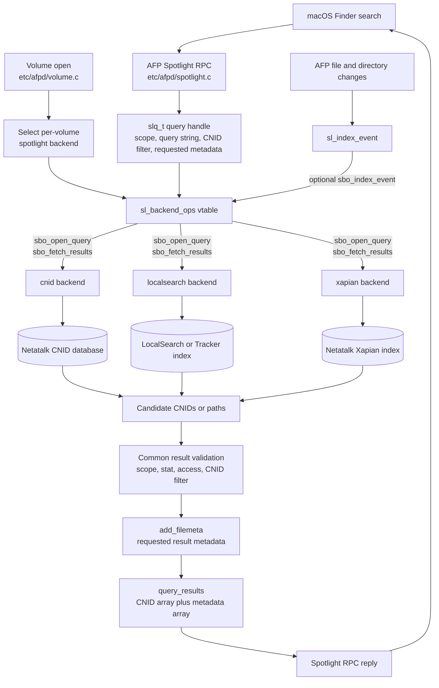

# Indexed Spotlight Search

Starting with version 3.1 Netatalk supports Spotlight-compatible
searching for macOS clients.

The AFP Spotlight RPC implementation lives in `etc/afpd/spotlight.c`.
It is shared by all Spotlight search backends. Query execution is delegated
to a per-volume backend selected with the `spotlight backend` configuration
option.

**Note**: Remote Netatalk volumes are searchable through **Finder search**
in macOS, not through the Spotlight Search widget.
Spotlight Search is reserved for local volumes.
This is a macOS client behavior and not a Netatalk limitation.

## Backend interface

Spotlight backends implement the `sl_backend_ops` vtable declared in
`include/atalk/spotlight.h`.

| Hook | Purpose |
|------|---------|
| `sbo_init` | Initialize backend process or connection state. |
| `sbo_close` | Release backend global state on shutdown. |
| `sbo_open_query` | Start or execute a Spotlight query. |
| `sbo_fetch_results` | Fill the next page of query results. |
| `sbo_close_query` | Cancel and free per-query backend state. |
| `sbo_index_event` | Optional hook for incremental index updates. |

The common query handle is `slq_t`. It carries the query string, search
scope, requested metadata, optional CNID filter, result limit, query state,
and backend-private query state.

Enabled backend ops are declared in `etc/spotlight/sl_backends.h`.
At volume open time, `etc/afpd/volume.c` binds `vol->v_sl_backend` to one
of the compiled backends.

## Data flow overview



## Available backends

| Backend | Source | Storage | Query model | Index updates |
|---------|--------|---------|-------------|---------------|
| `cnid` | `etc/spotlight/cnid/` | Netatalk CNID database | Filename-oriented search through `cnid_find()` | No separate Spotlight index |
| `localsearch` | `etc/spotlight/localsearch/` | GNOME LocalSearch/Tracker over D-Bus/SPARQL | Metadata and full-text query mapping | Managed by LocalSearch/Tracker |
| `xapian` | `etc/spotlight/xapian/` | Per-volume Xapian database | Filename, plain text, MIME/type/category terms | AFP file events plus full reconciliation |

The Meson option `with-spotlight-backends` controls which backends are
built. Supported values are `cnid`, `localsearch`, and `xapian`.

The global `sparql results limit` option is shared by LocalSearch and
Xapian despite its historical name. A value of `0` leaves LocalSearch
SPARQL queries unlimited. Xapian applies a 10000 candidate-result safety
cap in that case because the backend materializes candidate paths before
paging validated results back to the client. The CNID backend has its own
fixed CNID search reply cap.

## Query flow

1. The macOS client sends an AFP Spotlight RPC.
2. `etc/afpd/spotlight.c` unpacks the request into an `slq_t`.
3. The selected backend handles `sbo_open_query`.
4. The backend finds candidate paths or CNIDs.
5. Before returning results, backends validate paths with `stat()` and
   access checks, resolve or filter CNIDs, and call `add_filemeta()`.
6. Results are returned in pages as CNID arrays plus metadata arrays.

All current backends ultimately return filesystem results through the same
`query_results` structure.

## CNID backend

The CNID backend is the smallest backend. It extracts a filename search
term from common Spotlight predicates such as `kMDItemFSName`,
`kMDItemDisplayName`, `_kMDItemFileName`, and simple `*==` wildcard
queries.

It searches the Netatalk CNID database with `cnid_find()`, resolves CNIDs
back to paths with `cnid_resolve()`, and returns matching files. It does
not maintain a separate Spotlight index and does not implement
`sbo_index_event`.

## LocalSearch backend

The LocalSearch backend maps Spotlight RAW query strings to SPARQL using
the lexer, parser, and attribute map in `etc/spotlight/localsearch/`.

It keeps a process-level Tracker/LocalSearch connection in `AFPObj::sl_ctx`
and uses asynchronous SPARQL queries. Returned URIs are converted back to
Unix paths, checked against the filesystem, resolved to CNIDs, and packed
into Spotlight result pages.

The `spotlight attributes` option can restrict which mapped Spotlight
attributes are accepted by the SPARQL mapper.

## Xapian backend

The Xapian backend is split into a C backend adapter and a C++ wrapper:

| File | Responsibility |
|------|----------------|
| `sl_xapian.c` | Implements `sl_backend_ops`, result paging, CNID filtering, state directory setup, and incremental event routing. |
| `sl_xapian.h` | C ABI between C backend code and the C++ libxapian implementation. |
| `xapian_wrapper.cc` | Owns libxapian, libmagic, full reconciliation, document indexing, query building, and exception handling. |

Each volume uses a database under:

```shell
_PATH_STATEDIR/spotlight/xapian/<volume uuid>
```

On first query for a volume, the backend reconciles the Xapian database by
walking the volume, indexing visible regular files and directories, and
deleting stale documents. Each Xapian document stores the path, type,
mtime, size, MIME type, and terms for filename, body text, MIME, and
category search.

The Xapian index is shared per volume, not per AFP user. For that reason,
body text is indexed only from regular files that are world-readable,
readable by the indexing process, plain-text-like, and below the text size
limit. Files readable to a specific AFP user but not world-readable may be
found by filename or type, but not by `kMDItemTextContent`.

AFP file and directory operations call `sl_index_event()`. The Xapian
backend uses those events to upsert changed paths, delete removed paths,
delete directory prefixes, or reindex only the affected subtree after
directory moves. If subtree reindexing fails, the backend marks the index
dirty so a later query can repair it with reconciliation.

## Supported metadata attributes

Spotlight attribute support depends on the selected backend. There are two
different kinds of support:

* query support: attributes that can be used in a Spotlight search predicate;
* result metadata support: attributes that Netatalk can return for a matched
  filesystem object.

### Searchable attributes

The following table lists the Spotlight attributes currently supported in
search predicates, based on Apple's
[MDItem object](https://developer.apple.com/documentation/coreservices/mditemref/)
Core Services file metadata standard.

| Description | Spotlight Key | CNID | LocalSearch | Xapian |
|-------------|---------------|------|-------------|--------|
| Name | `kMDItemDisplayName`, `kMDItemFSName`, `_kMDItemFileName` | yes | yes | yes |
| Any-term wildcard search | `*` / `*==` query form | filename only | filename or full text | filename or plain-text body |
| Document content | `kMDItemTextContent` | no | yes | plain text files only |
| File type / kind | `_kMDItemGroupId`, `kMDItemContentTypeTree` | no | yes | yes |
| File type / kind | `kMDItemContentType`, `kMDItemKind` | no | no | yes |
| File modification date | `kMDItemFSContentChangeDate`, `kMDItemContentModificationDate`, `kMDItemAttributeChangeDate` | no | yes | no |
| Content creation date | `kMDItemContentCreationDate` | no | yes | no |
| Last used date | `kMDItemLastUsedDate` | no | yes | no |
| Authors / creator | `kMDItemAuthors`, `kMDItemCreator` | no | yes | no |
| Copyright | `kMDItemCopyright` | no | yes | no |
| Country | `kMDItemCountry` | no | yes | no |
| Duration | `kMDItemDurationSeconds` | no | yes | no |
| Number of pages | `kMDItemNumberOfPages` | no | yes | no |
| Document title | `kMDItemTitle` | no | yes | no |
| Pixel width | `kMDItemPixelWidth` | no | yes | no |
| Pixel height | `kMDItemPixelHeight` | no | yes | no |
| Color space | `kMDItemColorSpace` | no | yes | no |
| Bits per sample | `kMDItemBitsPerSample` | no | yes | no |
| Focal length | `kMDItemFocalLength` | no | yes | no |
| ISO speed | `kMDItemISOSpeed` | no | yes | no |
| Orientation | `kMDItemOrientation` | no | yes | no |
| Resolution width | `kMDItemResolutionWidthDPI` | no | yes | no |
| Resolution height | `kMDItemResolutionHeightDPI` | no | yes | no |
| Exposure time | `kMDItemExposureTimeSeconds` | no | yes | no |
| Composer | `kMDItemComposer` | no | yes | no |
| Musical genre | `kMDItemMusicalGenre` | no | yes | no |

### Returned result metadata

All backends use the shared `add_filemeta()` helper when returning results.
The following result metadata keys are currently populated from filesystem
metadata when requested:

| Description | Spotlight Key |
|-------------|---------------|
| Name | `kMDItemDisplayName`, `kMDItemFSName`, `_kMDItemFileName` |
| Path | `kMDItemPath` |
| Size | `kMDItemFSSize`, `kMDItemLogicalSize` |
| Owner user ID | `kMDItemFSOwnerUserID` |
| Owner group ID | `kMDItemFSOwnerGroupID` |
| File modification date | `kMDItemFSContentChangeDate`, `kMDItemContentModificationDate` |
| Last used date | `kMDItemLastUsedDate` |
| Content creation date | `kMDItemContentCreationDate`, when supported by the platform stat structure |

Requested result attributes outside this list are returned as nil.

## Limitations and notes

* CNID backend

    The CNID backend depends on CNID database consistency and is intended
    for simple filename search rather than full Spotlight metadata search.

* LocalSearch backend

    The LocalSearch backend depends on LocalSearch/Tracker, TinySPARQL,
    GLib, D-Bus, and the host indexer's filesystem monitoring behavior.

    Tracker on Linux uses the inotify Kernel filesystem change event API
    for tracking filesystem changes. On large filesystems this may be
    problematic since the inotify API does not offer recursive directory
    watches but instead requires that for every subdirectory watches must
    be added individually.

    On Solaris the FEN file event notification system is used. It is
    unknown which limitations and resource consumption this Solaris
    subsystem may have.

    A known limitation means that shared volumes in a user's home directory
    may not get indexed by LocalSearch/Tracker. As a workaround, keep the
    shared volumes you want to have indexed elsewhere on the host filesystem.

* Xapian backend

    The Xapian backend is managed by Netatalk itself. Its index is local to
    the Netatalk state directory and is refreshed by a full reconciliation
    on first use, then by AFP-originated file events. Changes made outside
    AFP may not be reflected until reconciliation runs again.

    Body text indexing is intentionally limited to world-readable regular
    files, because the Xapian database is a shared per-volume index. This
    avoids adding private file contents to shared index terms, but means
    content searches can miss files that the connected AFP user can read
    through owner, group, or ACL permissions.
